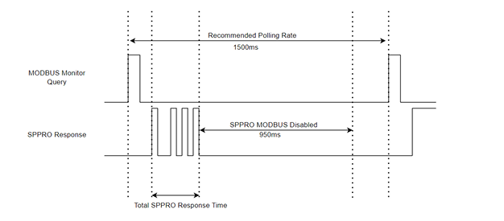

# SP PRO Modbus register reference

The SP PRO exposes a Modbus RTU slave interface, separate from the native serial protocol this
project speaks. The register map below was supplied by Selectronic support in October 2026 in
response to a request for documentation, and is reproduced here as interface facts for
interoperability.

**This is not what splink uses.** The bridge speaks the native protocol over USB or a serial
adaptor, which reaches considerably more of the device — see [Coverage](#coverage) at the end
for how the two compare. The map is here because it is the only vendor-documented description
of any SP PRO interface, which makes it useful for cross-checking a decode and for anyone who
would rather build on a supported interface than a recovered one.

## Interface

| | |
| --- | --- |
| Transport | Modbus RTU over **RS485-1 on the Advanced Communication Card (ACC)** |
| Function | Read Holding Register (`0x03`) |
| Register base | 8000 (decimal) |
| Documented for | SP PRO firmware V14.47, ACC V4.31 onwards |

Note that RS485-1 on the ACC is a *different* port from the one a managed AC-coupled solar
inverter uses. On an AC-coupled installation the SP PRO is itself the Modbus **master** to the
solar inverters on that other bus, so adding a second master there would collide. The ACC port
is where the SP PRO acts as a slave and is the one to poll.

### Worked example

Reading 4 registers from address 8000, at Modbus slave address 10:

```
Tx:  0a 03 1f 40 00 04 43 72
Rx:  0a 03 08 02 28 02 da 00 10 ff e3 c0 a5
```

Decoding the response against the table below:

| register | raw | scale | value |
| --- | --- | --- | --- |
| 8000 Battery Voltage | `0x0228` = 552 | 0.1 V | 55.2 V |
| 8001 Battery SoC | `0x02da` = 730 | 0.1 % | 73.0 % |
| 8002 Battery Power | `0x0010` = 16 | 10 W | 160 W |
| 8003 Battery Current | `0xffe3` = −29 | 0.1 A | −2.9 A |

Worth noting from that sample: 55.2 V × 2.9 A = 160 W, so the magnitudes agree, but power reads
positive while current reads negative. The two registers do not share a sign convention, so do
not infer direction from one and magnitude from the other.

## Timing requirements

Selectronic state that for **firmware v16.11 and ACC v5.31 or later** the following must be met
to keep the Modbus interface reliable and the system stable:

- **At most 10 registers per transaction**
- **Polling intervals greater than 1.5 s**
- Retry timeouts of **at least 1 second**, and no aggressive retry strategy that would amplify
  traffic when conditions are already degraded
- Modbus error rate below 1%
- A dedicated Modbus connection to the SP PRO, to keep other devices off the exchange
- Acceptable noise floor and signal integrity on both Modbus and CAN, with proper terminations
- Verification of the design with an oscilloscope or communications analyser

Observed response times:

| registers requested | total SP PRO response time |
| --- | --- |
| 110 | ~250 ms |
| 10 | ~60 ms |



The SP PRO disables its Modbus interface for roughly 950 ms after responding, which is what
sets the 1500 ms recommended polling rate: a query arriving inside that window gets no answer.

These constraints apply to the Modbus interface specifically. They are a property of that
RS485 link and the ACC firmware, not of the device as a whole — the native protocol over USB
CDC is a different physical layer and behaves differently.

## Registers

`R` is read-only, `RW` readable and writable. All are 16-bit; `signed` and `unsigned` are as
documented.

### Power, energy and status

| Address | Name | R/W | Type | Scale |
| --- | --- | --- | --- | --- |
| 8000 | Battery Voltage | R | signed | 0.1 V |
| 8001 | Battery SoC | R | signed | 0.1 % |
| 8002 | Battery Power | R | signed | 10 W |
| 8003 | Battery Current | R | signed | 0.1 A |
| 8004 | AC Load Power | R | signed | 10 W |
| 8005 | AC Load Voltage | R | signed | 0.1 V |
| 8006 | AC Load Frequency | R | signed | 0.1 Hz |
| 8007 | AC Load Energy | R | signed | 0.1 kWh |
| 8008 | AC Source Power | R | signed | 10 W |
| 8009 | AC Source Voltage | R | signed | 0.1 V |
| 8010 | AC Source Current | R | signed | 0.1 A |
| 8011 | AC Source Frequency | R | signed | 0.1 Hz |
| 8012 | AC Source Reactive | R | signed | 10 VAr |
| 8013 | AC Source Input Energy | R | signed | 0.1 kWh |
| 8014 | AC Source Export Energy | R | signed | 0.1 kWh |
| 8015 | AC Inverter Power | R | signed | 10 W |
| 8016 | AC Inverter Current | R | signed | 0.1 A |
| 8017 | Inverter Reactive | R | signed | 10 VAr |
| 8018 | Output Status | R | unsigned | 0 = Off, 1 = Econo, 2 = On, 3 = Sync |
| 8019 | Battery Temperature | R | signed | 0.1 °C |
| 8020 | Transformer Temperature | R | signed | 0.1 °C |
| 8021 | Heatsink Temperature | R | signed | 0.1 °C |
| 8022 | Solar Hybrid Priority Active | R | unsigned | 0 = none, other = priority active |

### Limits and overrides

| Address | Name | R/W | Type | Scale | Notes |
| --- | --- | --- | --- | --- | --- |
| 8023 | AC Source Input Limit | R | signed | 10 W | |
| 8024 | Grid Export Limit | R | signed | 10 W | |
| 8025 | Charge Limit | R | signed | 10 W | |
| 8026 | AC Load Support Limit | R | signed | 10 W | |
| 8027 | Battery Charging Status | R | unsigned | 0 = Normal charge, 1 = Override charge, 2 = Charger Off, 3 = Renewable charge, 4 = Restricted charge | |
| 8028 | Inverter Shutdown Status | R | unsigned | 0 = Not Active, 1 = Active | |
| 8029 | Grid Disconnect Status | R | unsigned | 0 = Not Active, 1 = Active | |
| 8030 | Active Power Override Target | R | signed | 10 W | |
| 8031 | SoC Shutdown Recovery Active | R | unsigned | 0 = Not Active, 1 = Active | |
| 8032 | Set Power Override Target | **RW** | signed | 10 W | Reading it is invalid. Write 0 to disable the override. Output Status must be `Sync` for an override to take effect. |
| 8033 | Set Var Override Target | **RW** | signed | 10 VAr | As above. |

> Registers 8034–8083 were not included in the material supplied and are not documented here.

### Shunts, AC-coupled solar and identity

| Address | Name | R/W | Type | Scale | Notes |
| --- | --- | --- | --- | --- | --- |
| 8084 | Shunt 1 Power | R | signed | 10 W | |
| 8085 | Shunt 2 Power | R | signed | 10 W | |
| 8086 | 5 Minute Battery Load | R | signed | 10 W | |
| 8087 | 15 Minute Battery Load | R | signed | 10 W | |
| 8088 | AC Coupled Solar Target % | R | unsigned | 0.1 % | The commanded output limit for managed AC-coupled solar |
| 8089 | AC Coupled Solar #1 Power | R | signed | 10 W | |
| 8090 | AC Coupled Solar #2 Power | R | signed | 10 W | |
| 8091 | AC Coupled Solar #3 Power | R | signed | 10 W | |
| 8092 | AC Coupled Solar #4 Power | R | signed | 10 W | |
| 8093 | AC Coupled Solar #5 Power | R | signed | 10 W | |
| 8094 | Target Charge Current | R | signed | 0.1 A | |
| 8095 | Target Charge Voltage | R | signed | 0.1 V | |
| 8096 | Fan Speed | R | unsigned | 0.1 % | |
| 8097 | Battery Input Energy | R | unsigned | 0.1 kWh | |
| 8098 | Battery Output Energy | R | unsigned | 0.1 kWh | |
| 8099 | AC Coupled Input Energy | R | unsigned | 0.1 kWh | |
| 8100 | Minutes of AC Source | R | unsigned | 1 minute | |
| 8101 | SP PRO Total Run Time | R | unsigned | 1 hour | |
| 8102 | Unit Serial Number | R | unsigned | low word | |
| 8103 | Unit Serial Number | R | unsigned | high word | |
| 8104 | SP PRO Software Version | R | unsigned | `x.yy` | major `x`, minor `yy` |
| 8105 | Comms Card Software Version | R | unsigned | `x.yy` | major `x`, minor `yy` |
| 8106 | AC source power config | **RW** | unsigned | 10 W | |
| 8107 | AC Inverter Power Worker-1 | R | signed | 10 W | ACC version 5.20 or higher only |

## Coverage

Of the 55 registers documented above, **50 have a counterpart the native protocol already
provides**, generally at finer resolution — the native values are raw counts scaled by
model-specific factors read from the device, rather than pre-rounded to 0.1 V or 10 W.

Genuinely absent from the native decode, all of them grid-connect or power-override status
flags:

- 8022 Solar Hybrid Priority Active
- 8028 Inverter Shutdown Status
- 8029 Grid Disconnect Status
- 8030 Active Power Override Target
- 8031 SoC Shutdown Recovery Active
- 8107 AC Inverter Power Worker-1 (multi-unit installations only)

They may well exist in the native register space among the words SP LINK reads but never
labels; that is unresolved.

Going the other way, the native protocol reaches a great deal the Modbus map does not: all 563
configuration settings, the four on-device logs, and roughly 945 words across fifteen display
blocks. So Modbus is the better-supported interface and the smaller one.

One discrepancy worth recording: 8088 "AC Coupled Solar Target %" at 0.1 % per bit matches the
scaling of a native Now-block word that reads a constant zero on a test system whose array is
demonstrably producing. Either the commanded target genuinely is zero, or the two are not the
same quantity.

## Provenance

Supplied by Selectronic Australia support, October 2026, in response to a customer request for
Modbus documentation. Transcribed here as interface facts. Not affiliated with or endorsed by
Selectronic Australia Pty Ltd; "SP PRO" is their trademark.
